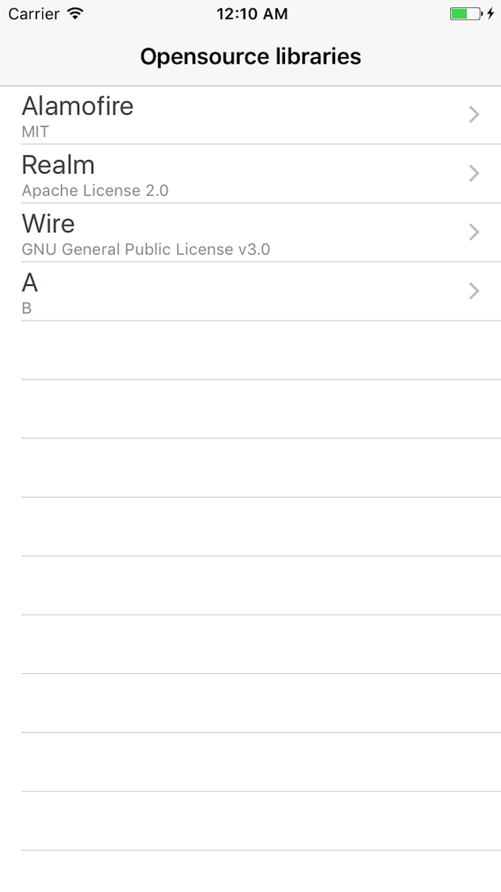
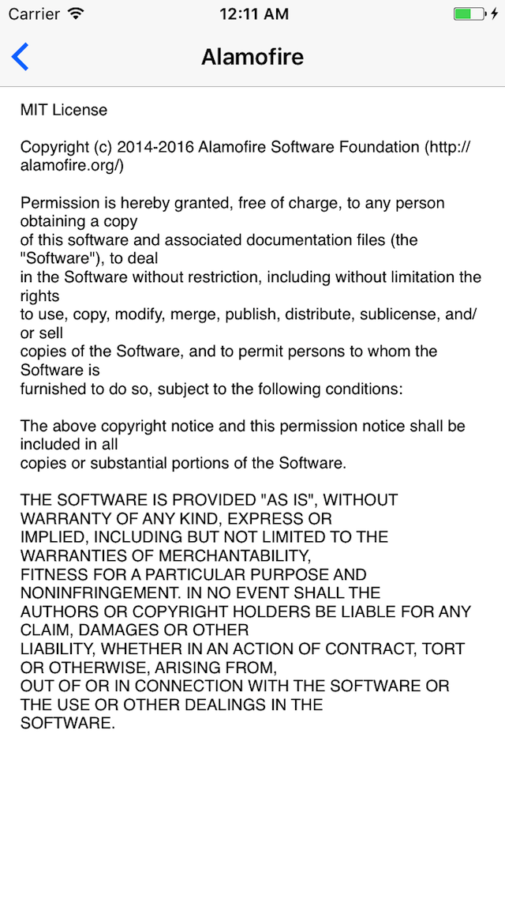
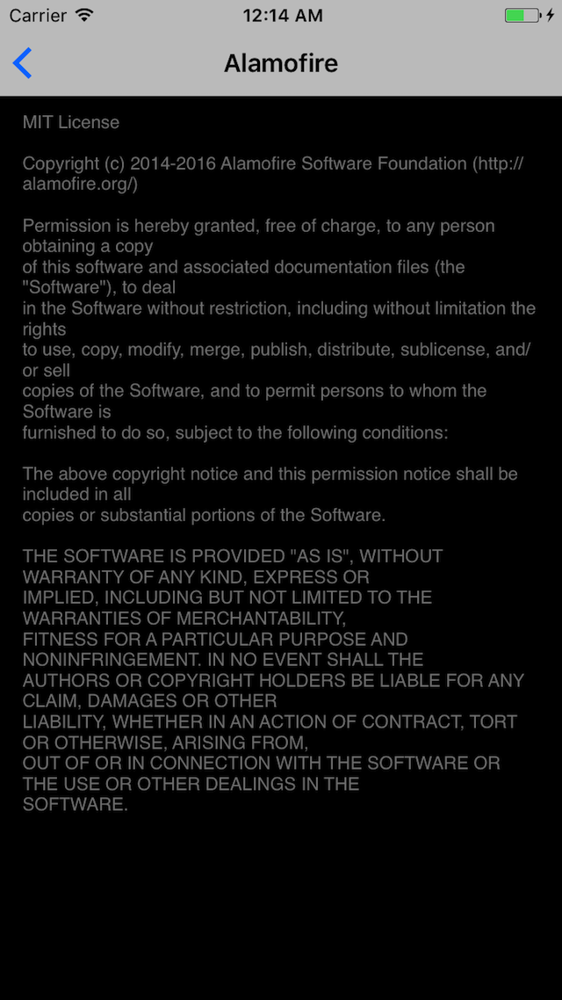

# CPOpenSourceLicenses

Shows a list of open source licenses used within the app.

Simply add the license file without looking for it.

## Screenshots

  

## Features

* GNU Affero General Public License v3.0
* GNU General Public License v3.0
* GNU Lesser General Public License v3.0
* Mozilla Public License 2.0
* Apache License 2.0
* MIT
* The Unlicense
* Custom

## Requirements

* iOS 9.0+
* Xcode 8.3
* Swift 3.0+

## Installation

Cocoapods
```
pod 'CPOpenSourceLicenses'
```

Carthage
```
github 'yoonhg84/CPOpenSourceLicenses'
```

## Usage

Set up a license for open source.

```swift
let vc = CPOpenSourceLibrariesViewController()
vc.openSourceList = [
  CPOpenSource(title: "Alamofire", license: .mit(year: "2014-2016", fullname: "Alamofire Software Foundation (http://alamofire.org/)")),
  CPOpenSource(title: "Realm", license: .apacheLicense2),
  CPOpenSource(title: "Wire", license: .gnuGPLv3(project: nil, year: nil, fullname: nil, nameOfAuthor: nil)),
]
present(UINavigationController(rootViewController: vc), animated: true)
```

If you want to customize the license view, implement **CPOpenSourceLicenseView** protocol.

```swift
    override func viewDidAppear(_ animated: Bool) {
        super.viewDidAppear(animated)


        let vc = CPOpenSourceLibrariesViewController()
        vc.openSourceList = [
                CPOpenSource(title: "Realm", license: .apacheLicense2)
        ]
        vc.openSourceLicenseViewClass = LicenseViewController.self
        present(UINavigationController(rootViewController: vc), animated: true)
    }
}

class LicenseViewController: CPOpenSourceLicenseViewController {
    public override func viewDidLoad() {
        super.viewDidLoad()

        textView.backgroundColor = UIColor.clear
        textView.textColor = UIColor.gray
        view.backgroundColor = UIColor.black
    }
}
```

## TODO

* generate CPOpenSource from cocoapods
* generate CPOpenSource from carthage

## License

CPOpenSourceLicenses is released under the MIT license. See LICENSE for details.